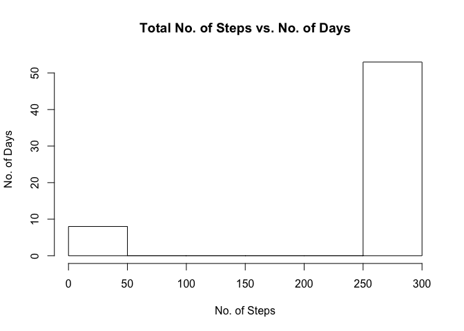
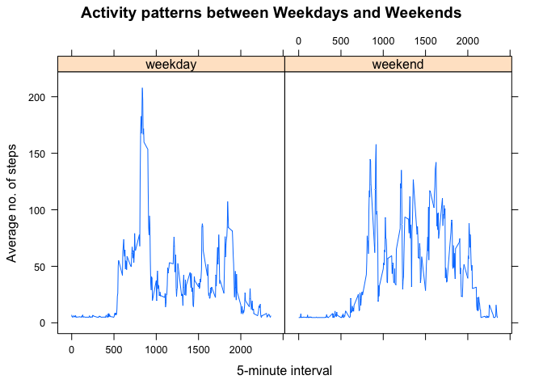

Course Project 1
----------------

### Loading and preprocessing the data

The following code is used to load the data from the csv file into
variable *fitdata* and to convert the Date format:

    fitdata = read.csv("activity.csv")  # read csv file
    fitdata$date <- as.Date(fitdata$date)
    str(fitdata)

    ## 'data.frame':    17568 obs. of  3 variables:
    ##  $ steps   : int  NA NA NA NA NA NA NA NA NA NA ...
    ##  $ date    : Date, format: "2012-10-01" "2012-10-01" ...
    ##  $ interval: int  0 5 10 15 20 25 30 35 40 45 ...

### What is mean total number of steps taken per day?

The total no. of steps taken per day can be retrieved using the
following code:

    library(plyr)
    sumFit <- ddply(fitdata, c("date"), summarise, sum = sum(!is.na(steps)))
    show(sumFit)

    ##          date sum
    ## 1  2012-10-01   0
    ## 2  2012-10-02 288
    ## 3  2012-10-03 288
    ## 4  2012-10-04 288
    ## 5  2012-10-05 288
    ## 6  2012-10-06 288
    ## 7  2012-10-07 288
    ## 8  2012-10-08   0
    ## 9  2012-10-09 288
    ## 10 2012-10-10 288
    ## 11 2012-10-11 288
    ## 12 2012-10-12 288
    ## 13 2012-10-13 288
    ## 14 2012-10-14 288
    ## 15 2012-10-15 288
    ## 16 2012-10-16 288
    ## 17 2012-10-17 288
    ## 18 2012-10-18 288
    ## 19 2012-10-19 288
    ## 20 2012-10-20 288
    ## 21 2012-10-21 288
    ## 22 2012-10-22 288
    ## 23 2012-10-23 288
    ## 24 2012-10-24 288
    ## 25 2012-10-25 288
    ## 26 2012-10-26 288
    ## 27 2012-10-27 288
    ## 28 2012-10-28 288
    ## 29 2012-10-29 288
    ## 30 2012-10-30 288
    ## 31 2012-10-31 288
    ## 32 2012-11-01   0
    ## 33 2012-11-02 288
    ## 34 2012-11-03 288
    ## 35 2012-11-04   0
    ## 36 2012-11-05 288
    ## 37 2012-11-06 288
    ## 38 2012-11-07 288
    ## 39 2012-11-08 288
    ## 40 2012-11-09   0
    ## 41 2012-11-10   0
    ## 42 2012-11-11 288
    ## 43 2012-11-12 288
    ## 44 2012-11-13 288
    ## 45 2012-11-14   0
    ## 46 2012-11-15 288
    ## 47 2012-11-16 288
    ## 48 2012-11-17 288
    ## 49 2012-11-18 288
    ## 50 2012-11-19 288
    ## 51 2012-11-20 288
    ## 52 2012-11-21 288
    ## 53 2012-11-22 288
    ## 54 2012-11-23 288
    ## 55 2012-11-24 288
    ## 56 2012-11-25 288
    ## 57 2012-11-26 288
    ## 58 2012-11-27 288
    ## 59 2012-11-28 288
    ## 60 2012-11-29 288
    ## 61 2012-11-30   0

    hist(sumFit$sum, main="Total No. of Steps vs. No. of Days",     xlab="No. of Steps", ylab = "No. of Days")

The mean and median of the total number of steps taken per day:

    mmFit <- ddply(fitdata, c("date"), summarise, mean = mean(steps, na.rm = TRUE), median = median(steps, na.rm = TRUE))
    show(mmFit)

    ##          date       mean median
    ## 1  2012-10-01        NaN     NA
    ## 2  2012-10-02  0.4375000      0
    ## 3  2012-10-03 39.4166667      0
    ## 4  2012-10-04 42.0694444      0
    ## 5  2012-10-05 46.1597222      0
    ## 6  2012-10-06 53.5416667      0
    ## 7  2012-10-07 38.2465278      0
    ## 8  2012-10-08        NaN     NA
    ## 9  2012-10-09 44.4826389      0
    ## 10 2012-10-10 34.3750000      0
    ## 11 2012-10-11 35.7777778      0
    ## 12 2012-10-12 60.3541667      0
    ## 13 2012-10-13 43.1458333      0
    ## 14 2012-10-14 52.4236111      0
    ## 15 2012-10-15 35.2048611      0
    ## 16 2012-10-16 52.3750000      0
    ## 17 2012-10-17 46.7083333      0
    ## 18 2012-10-18 34.9166667      0
    ## 19 2012-10-19 41.0729167      0
    ## 20 2012-10-20 36.0937500      0
    ## 21 2012-10-21 30.6284722      0
    ## 22 2012-10-22 46.7361111      0
    ## 23 2012-10-23 30.9652778      0
    ## 24 2012-10-24 29.0104167      0
    ## 25 2012-10-25  8.6527778      0
    ## 26 2012-10-26 23.5347222      0
    ## 27 2012-10-27 35.1354167      0
    ## 28 2012-10-28 39.7847222      0
    ## 29 2012-10-29 17.4236111      0
    ## 30 2012-10-30 34.0937500      0
    ## 31 2012-10-31 53.5208333      0
    ## 32 2012-11-01        NaN     NA
    ## 33 2012-11-02 36.8055556      0
    ## 34 2012-11-03 36.7048611      0
    ## 35 2012-11-04        NaN     NA
    ## 36 2012-11-05 36.2465278      0
    ## 37 2012-11-06 28.9375000      0
    ## 38 2012-11-07 44.7326389      0
    ## 39 2012-11-08 11.1770833      0
    ## 40 2012-11-09        NaN     NA
    ## 41 2012-11-10        NaN     NA
    ## 42 2012-11-11 43.7777778      0
    ## 43 2012-11-12 37.3784722      0
    ## 44 2012-11-13 25.4722222      0
    ## 45 2012-11-14        NaN     NA
    ## 46 2012-11-15  0.1423611      0
    ## 47 2012-11-16 18.8923611      0
    ## 48 2012-11-17 49.7881944      0
    ## 49 2012-11-18 52.4652778      0
    ## 50 2012-11-19 30.6979167      0
    ## 51 2012-11-20 15.5277778      0
    ## 52 2012-11-21 44.3993056      0
    ## 53 2012-11-22 70.9270833      0
    ## 54 2012-11-23 73.5902778      0
    ## 55 2012-11-24 50.2708333      0
    ## 56 2012-11-25 41.0902778      0
    ## 57 2012-11-26 38.7569444      0
    ## 58 2012-11-27 47.3819444      0
    ## 59 2012-11-28 35.3576389      0
    ## 60 2012-11-29 24.4687500      0
    ## 61 2012-11-30        NaN     NA

What is the average daily activity pattern?
-------------------------------------------

Time series plot could be developed using the following code:

    avgFit <- ddply(fitdata, c("interval"), summarise, avg = mean(steps, na.rm = TRUE))
    plot(avgFit$interval, avgFit$avg, type = "l", main="Average No. of Steps per 5-Minute Intervals", xlab = "5-minute interval", ylab = "Average no. of steps")

The 5-minute interval,that contains the maximum number of steps:

    avgFit$interval[which.max(apply(avgFit, MARGIN = 1,min))]

    ## [1] 835

Imputing missing values
-----------------------

The following lines of codes are used to calculate and report the total
number of missing values in the dataset:

    for (Var in names(fitdata)) {
        miss <- sum(is.na(fitdata[,Var]))
        if (miss > 0) {
            print(c(Var,miss))
        }
    }

    ## [1] "steps" "2304"

Creating a new dataset from *fitdata* with a filled-up missing values in
the dataset using mean:

    fitfill <- fitdata[1:3]
    fitfill$steps[is.na(fitfill$steps)] = mean(fitfill$steps, na.rm = TRUE)
    str(fitfill)

    ## 'data.frame':    17568 obs. of  3 variables:
    ##  $ steps   : num  37.4 37.4 37.4 37.4 37.4 ...
    ##  $ date    : Date, format: "2012-10-01" "2012-10-01" ...
    ##  $ interval: int  0 5 10 15 20 25 30 35 40 45 ...

Create a new histogram with filled dataset:

    sumFillFit <- ddply(fitfill, c("date"), summarise, sum1 = sum(!is.na(steps)))
    hist(sumFillFit$sum1, main="Total No. of Steps vs. No. of Days",     xlab="No. of Steps", ylab = "No. of Days")

The mean and median of the total number of steps taken per day:

    mmFillFit <- ddply(fitfill, c("date"), summarise, mean = mean(steps, na.rm = TRUE), median = median(steps, na.rm = TRUE))
    show(mmFillFit)

    ##          date       mean  median
    ## 1  2012-10-01 37.3825996 37.3826
    ## 2  2012-10-02  0.4375000  0.0000
    ## 3  2012-10-03 39.4166667  0.0000
    ## 4  2012-10-04 42.0694444  0.0000
    ## 5  2012-10-05 46.1597222  0.0000
    ## 6  2012-10-06 53.5416667  0.0000
    ## 7  2012-10-07 38.2465278  0.0000
    ## 8  2012-10-08 37.3825996 37.3826
    ## 9  2012-10-09 44.4826389  0.0000
    ## 10 2012-10-10 34.3750000  0.0000
    ## 11 2012-10-11 35.7777778  0.0000
    ## 12 2012-10-12 60.3541667  0.0000
    ## 13 2012-10-13 43.1458333  0.0000
    ## 14 2012-10-14 52.4236111  0.0000
    ## 15 2012-10-15 35.2048611  0.0000
    ## 16 2012-10-16 52.3750000  0.0000
    ## 17 2012-10-17 46.7083333  0.0000
    ## 18 2012-10-18 34.9166667  0.0000
    ## 19 2012-10-19 41.0729167  0.0000
    ## 20 2012-10-20 36.0937500  0.0000
    ## 21 2012-10-21 30.6284722  0.0000
    ## 22 2012-10-22 46.7361111  0.0000
    ## 23 2012-10-23 30.9652778  0.0000
    ## 24 2012-10-24 29.0104167  0.0000
    ## 25 2012-10-25  8.6527778  0.0000
    ## 26 2012-10-26 23.5347222  0.0000
    ## 27 2012-10-27 35.1354167  0.0000
    ## 28 2012-10-28 39.7847222  0.0000
    ## 29 2012-10-29 17.4236111  0.0000
    ## 30 2012-10-30 34.0937500  0.0000
    ## 31 2012-10-31 53.5208333  0.0000
    ## 32 2012-11-01 37.3825996 37.3826
    ## 33 2012-11-02 36.8055556  0.0000
    ## 34 2012-11-03 36.7048611  0.0000
    ## 35 2012-11-04 37.3825996 37.3826
    ## 36 2012-11-05 36.2465278  0.0000
    ## 37 2012-11-06 28.9375000  0.0000
    ## 38 2012-11-07 44.7326389  0.0000
    ## 39 2012-11-08 11.1770833  0.0000
    ## 40 2012-11-09 37.3825996 37.3826
    ## 41 2012-11-10 37.3825996 37.3826
    ## 42 2012-11-11 43.7777778  0.0000
    ## 43 2012-11-12 37.3784722  0.0000
    ## 44 2012-11-13 25.4722222  0.0000
    ## 45 2012-11-14 37.3825996 37.3826
    ## 46 2012-11-15  0.1423611  0.0000
    ## 47 2012-11-16 18.8923611  0.0000
    ## 48 2012-11-17 49.7881944  0.0000
    ## 49 2012-11-18 52.4652778  0.0000
    ## 50 2012-11-19 30.6979167  0.0000
    ## 51 2012-11-20 15.5277778  0.0000
    ## 52 2012-11-21 44.3993056  0.0000
    ## 53 2012-11-22 70.9270833  0.0000
    ## 54 2012-11-23 73.5902778  0.0000
    ## 55 2012-11-24 50.2708333  0.0000
    ## 56 2012-11-25 41.0902778  0.0000
    ## 57 2012-11-26 38.7569444  0.0000
    ## 58 2012-11-27 47.3819444  0.0000
    ## 59 2012-11-28 35.3576389  0.0000
    ## 60 2012-11-29 24.4687500  0.0000
    ## 61 2012-11-30 37.3825996 37.3826

From the histogram, mean, and median values, it is noted that the values
are different. The total no. of steps have been increased to 288 and
consistent throughout all dates. Mean and median values of empty data
are changing accordingly.

Are there differences in activity patterns between weekdays and weekends?
-------------------------------------------------------------------------

The following codes are used to generate the plots to differentiate
activity patterns between weekdays and weekends:

    wd <- c('Monday', 'Tuesday', 'Wednesday', 'Thursday', 'Friday')
    fitfill$day <- c('weekend', 'weekday')[(weekdays(fitfill$date) %in% wd)+1L]
    avgFillFit <- ddply(fitfill, c("interval", "day"), summarise, avg = mean(steps, na.rm = TRUE))
    library(lattice) 
    attach(fitfill)

    xyplot(avg~interval | day, avgFillFit, type = "l",
        main="Activity patterns between Weekdays and Weekends", 
       ylab="Average no. of steps", xlab="5-minute interval")

**END OF PROJECT**
